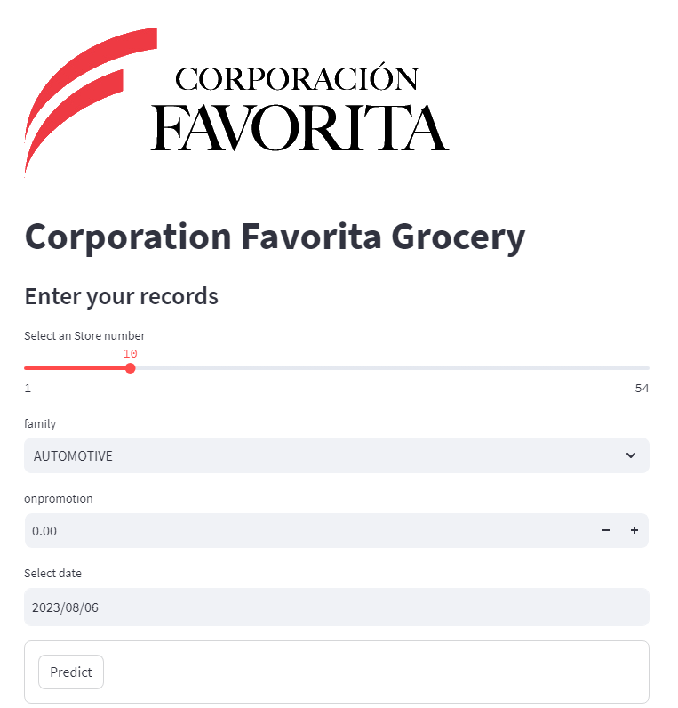
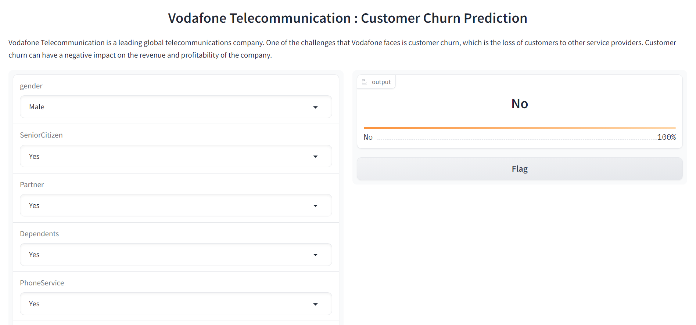

# 🚀 Friendly Web Interface for ML Projects with Gradio & Streamlit  🚀

<h3 align="center">
Hi there, I'm <b>Henok</b> 👋 
</h3>  

<h2 align="center">
I'm a Data Analyst and Python Programmer !
</h2> 
There are many ways to make web interfaces to allow interaction with Machine Learning models and we will cover two of them.

# Technical Skills 

## Description

This project is a Python-based application that can predict the sales of Corporation Favorita Grocery, a large Ecuadorian supermarket chain. The application uses Streamlit, an open-source framework that allows creating interactive web apps for machine learning and data science. The user can input various factors such as product category, store location, date, and promotion, and the app will output the expected sales for that scenario. This project can help Corporation Favorita Grocery optimize its inventory management and marketing strategies.

<!-- You can find the slides of my talk at <https://meissa-wimlds-presentation.netlify.app>. -->

## Installation

You have two ways in order to setup and run this project.

### Manual Setup

For manual installation, you need to have [`Python3`](https://www.python.org/) on your system. Then you can clone this repo and being at the repo's `root :: friendly_web_interface_for_ML_models> ...`  follow the steps below:

- Windows:
        
        python -m venv venv; venv\Scripts\activate;
        python -m pip install -q --upgrade pip;
        python -m pip install -qr requirements.txt  

- Linux & MacOs:
        
        python3 -m venv venv; source venv/bin/activate;
        python -m pip install -q --upgrade pip;
        python -m pip install -qr requirements.txt  

The both long command-lines have a same structure, they pipe multiple commands using the symbol **;** but you may manually execute them one after another.

1. **Create the Python's virtual environment** that isolates the required libraries of the project to avoid conflicts;
2. **Activate the Python's virtual environment** so that the Python kernel & libraries will be those of the isolated environment;
3. **Upgrade Pip, the installed libraries/packages manager** to have the up-to-date version that will work correctly;
4. **Install the required libraries/packages** listed in the `requirements.txt` file so that it will be allow to import them into the python's scripts and notebooks without any issue.

**NB:** For MacOs users, please install `Xcode` if you have an issue.

- Run the demo apps (being at the repository root):
        
- Streamlit:
    
     streamlit run streamlit_project\app.py;
       
- Gradio:
    
     gradio gradio_project\app.py;

The above code redirect you to your default browser, if not

- Go to your browser at the following address for streamlit:
        
      http://localhost:8501;
      
- Go to your browser at the following address for gradio:

        http://127.0.0.1:7860; # or
        http://127.0.0.1:7861
  
<!-- ## Structure
### File: app.py

### Folder: ml 

C:.
├───.pytest_cache
│   └───v
│       └───cache
├───gradio_project
│   ├───salary 
│   └───titanic
├───ml
│   ├───salary
│   └───titanic
├───streamlit_project
└───tests
    ├───gradio_project
    ├───ml
    └───streamlit_project

-->

## Screenshots

<table>
    <tr>
        <th>Streamlit Basic Demo</th>
    </tr>
    <tr>
        <td></td>
    </tr>
</table>

<table>
    <tr>
        <th>Gradio Basic Demo</th>
    </tr>
    <tr>
        <td></td>
    </tr>
</table>

## Resources
Here are some ressources you would read to have a good understanding of Gradio and Streamlit :
- [Get started with Streamlit](https://docs.streamlit.io/library/get-started/create-an-app)

- [Get started with Gradio](https://gradio.app/getting_started/)

## Contributing
[LAWRENCE LARWEH](https://gh.linkedin.com/in/lawrencelarweh)

## Author

- [HENOK SOLOMON](www.linkedin.com/in/henok-solomon-a3b537206)
